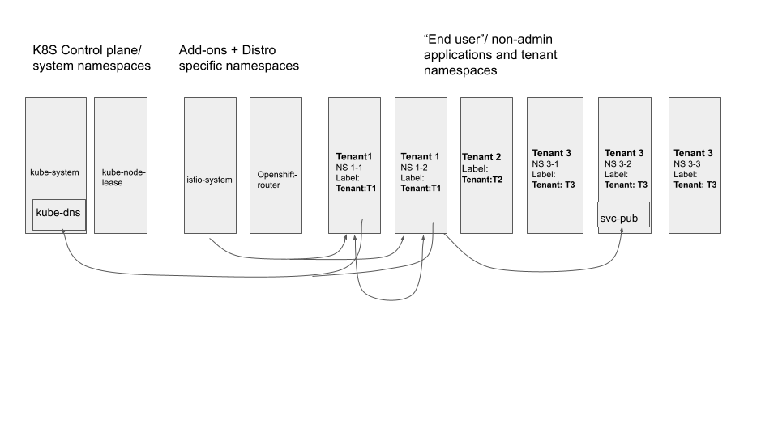

### Summary

As a cluster admin, I want to isolate all the tenants (modeled as Namespaces or
as groups of Namespaces) in my cluster from each other. This means that all 
across-Tenant traffic is denied unless a special exception is configured. The 
next 2 sections describe the target tenancy model that is desired.

### Description

Many enterprises are creating shared Kubernetes clusters that are managed by a
centralized platform team. Each internal team that wants to run their workloads
gets assigned a Namespace on the shared clusters. Naturally, the platform team
will want to make sure that, inter-namespace traffic between these tenants is
denied, so that the tenant won't interfere with each other in an unwanted way.

This cluster security posture could be achieved by applying a deny inter-Namespace
traffic policy to all the tenant Namespaces, with certain exceptions. Exceptions
may include: don't deny traffic from tenant Namespaces to kube-system Namespace,
or don't drop communication between tenant 1 and tenant 2 as requested by both
tenants.

### Tenancy Model

The following figure describes the target tenancy model that should be supported. Note 
that there are multiple other aspects and features needed for a full multitenancy solution.
Here we only focus on the requirements for Cluster scoped network policies in order to support 
the network level aspects of this sort ot multitenancy solution. Of course an implementation
can also choose to simpler version of this solution such as limiting a tenant always to a single 
namespace only and that would be a sub-set of this solution.

  

In the example shown in the figure, there are 3 categories of namespaces in the target solution: 
1) Core Kubernetes control plane namespaces such as kube-system or kube-node-lease. 2) Cluster services that are 
implemented via add-ons such as Istio for service mesh or Prmoetheus for cluster monitoring as well 
as Kubernetes vendor distro specific namespaces as shownb in the figure 
3) True application tenant namespaces that run the end user applications on a per-tenant basis isolated from 
each other within the same cluster.

Using the example of Tenant T1 in this case, it is comprised of 2 Kubernetes namespaces that are 
labeled with a unique cluster admin configiured label that uniquely identifies these to be part of 
Tenant T1. Pods belonging to this tenant can only communicate with (1) Other pods anywhere within the same tenant T1's 2
namespaces (2) specific pods in the kube-system namespace (such as only initiating connections 
to pods backing the kube-dns service) (3) some select cluster add-on services from the add-on services namespaces as 
determined by the cluster admin (such as access to/ from specific pods in istio-system or namespace) and (4) 
connections to "public services" provided by specific other tenants determined by the cluster admin such as T3 
in this figure. An example of such a "public service" could be an enterprise wide security scanning service 
provided by central enterprise IT running as tenant T3 and exposed as a Kubernetes service to other tenants 
within the cluster. These desired communication paths are illustrated using arrows in the above figure and 
all other communication paths need to  be blocked by the cl;uster admin. Such a solution should be implementable 
via the target cluster scoped network policies.

### Acceptance Criteria

If I apply a tenant isolation policy to certain Namespaces in the cluster, these
Namespace should deny inter-namespace traffic, unless listed as exempt or
explicited allowed by higher-order policy rules.

### Notes

Comments in the [ClusterNetworkPolicy KEP](https://github.com/kubernetes/enhancements/pull/2522#discussion_r632866263)
and disucssion in the sig-network group seems to suggest that tenants are often
modeled as a set of Namespaces in addition to single Namespace (two Namespaces
with label app=coke below to a single tenant and three Namespaces with label
app=pepsi below to another tenant). In this case, tenant isolation would imply
traffic is only denied to/from Namespaces that has different label value as self,
for some label key used for tenant identification.

Another [comment thread](https://github.com/kubernetes/enhancements/pull/2522/files#r604694072)
from the same KEP explores whether the Namespace isolation should be enforced
(i.e. not overridable by K8s NetworkPolicy). Most reviewers agree that 1) This
tenant boundary policy should not be overriden by tenants; they can only be
amended by cluster admins 2) Tenant Namespace isolation should not imply that
intra-Namespace traffic is allowed; tenants should be able to segment their own
Namespaces as they wish via K8s NetworkPolicies.
