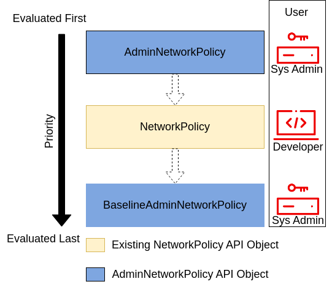

# NPEP-285: NPEP template

* Issue: [#285](https://github.com/kubernetes-sigs/network-policy-api/issues/285)
* Status: Experimental

## TLDR

Combine ANP and BANP into a single CRD.

## Goals

- Outline existing differences between ANP and BANP.
- Merge ANP and BANP into a single CRD.

## Non-Goals

(What is explicitly out of scope for this proposal.)

## Introduction

ANP and BANP are 2 layers of policies around NetworkPolicy, evaluated as shown in the diagram below.

  
Currently, ANP and BANP are 2 separate CRDs with the following differences:
- BANP is a singleton, which is also the reason why it doesn't have `spec.priority` field.
- ANP supports `Pass` action, while BANP doesn't. `Pass` action could be considered a delegation to the NetworkPolicy, or it could be seen as return from the current policy layer .
- ANP supports `domainNames` matching for egress rules, while BANP doesn't.

## User-Stories/Use-Cases

Story 1: Multiple BANPs

As a cluster admin, I want to apply different BANPs to different sets namespaces, so that I can have different default trust levels.
For example, "system" namespaces, like kube-system, could have a less strict BANP than "user" namespaces.

Story 2: Single CRD

As a cluster admin, I prefer to have 1 CRD for both ANP and BANP, so that it is easier to manage, understand, and monitor.
As an API implementation developer, I prefer to have 1 CRD for both ANP and BANP, so that I can reduce the complexity of the code.

## API

### Combining ANP and BANP

To combine ANP and BANP, we need to have a way to specify policy layer. Currently, we have the following options:
- Add a new field `spec.tier` to distinguish ANP vs BANP. The values could be `Override` and `Baseline`.
- Change `spec.priority` field to have a pre-defined value for NetworkPolicy, use numbers below for ANP, and numbers above for BANP.
For example, if we set NetworkPolicy priority to 0, then negative priorities would mean ANP, and positive priorities would mean BANP. 

We prefer to go with the first option, because using negative numbers is more difficult to understand and explain, plus
the semantics of `Pass` action becomes too confusing and too hard to explain.
"Pass skips over all remaining ANPs with priority greater than 0, then checks NPs, then comes back and processes the rest of the ANPs with priority less than 0."

#### Here we go again... naming

Trying to find the right name for the `spec.tier` field wasn't easy and brought up the discussion about the CRD name itself.

1. Persona-based naming

Current naming is persona/user-focused, AdminNetworkPolicy is a cluster-scoped policy and DeveloperNetworkPolicy was supposed to be
a replacement for the namespaced NetworkPolicy (instead of NetworkPolicy v2).
This may be confusing, because nothing prevents "developers" with the right RBAC from creating AdminNetworkPolicies.
And admins also could use DeveloperNetworkPolicies to enforce policies on some namespaces.
This naming also prevents (or makes more confusing) adding more personas in the future, like Platform/Infrastructure team that
could have its own `tier` in AdminNetworkPolicy not really being cluster admins.

The suggestion is to rename the resource to `ClusterNetworkPolicy` and do tier names based on the personas, 
like Admin/Baseline/Platform. NetworkPolicy v2 could be called ApplicationNetworkPolicy (as was originally proposed).

2. Changing name is a challenge

We have advertised ANP/BANP a lot during previous kubecons, and we also have some implementations with real customers
that are using it.  
On the other hand, this is our last chance to do what is right before beta. We also hope that a new name will make
the distinction between the first alpha API set of ANP+BANP vs second alpha using ClusterNetworkPolicy(CNP) more obvious.

After a community discussion, we agreed that CNP makes more sense and we should change the name while we still have a chance.

#### Find a better name for `spec.priority`

While we are here, `priority` field name was brought to our attention multiple times as confusing. It should be mostly related to the fact
that "higher priority" means "lower number", which is counter-intuitive. Suggested alternatives are "order" and "sequence".

On the other hand "priority" is a well-known term in the networking world, and the live survey during [sig-network updates EU 2025](https://www.youtube.com/watch?v=lBOdQHNNgEU)
showed that a majority of people understands the `priority` field correctly. Some examples from the industry:
- [google cloud firewall](https://cloud.google.com/firewall/docs/firewalls#priority_order_for_firewall_rules)
- [AWS Network FIrewall](https://docs.aws.amazon.com/network-firewall/latest/developerguide/suricata-rule-evaluation-order.html)
- [Azure Firewall](https://learn.microsoft.com/en-us/azure/firewall/rule-processing)

Therefore leaving `priority` as a field name seems reasonable.

#### Find a better name for `Pass` action

With the new semantics, `Pass` should mean "delegate to the next tier"/"return from the current tier", therefore some new names were suggested:
- Pass/Skip/Return - all missing context (pass to what/skip what) and require reading the docs (potentially more than once)
- NextTier/gotoNextTier - more explicit, but Tier could also be misinterpreted. For example, NetworkPolicy is considered to
be its own tier, but the API doesn't have such field, so while `nextTier` after `Admin` is NetworkPolicy, it could be
interpreted as next tier is `Baseline` (or whichever CNP tier comes next).  

We agreed to leave `Pass` as an action, since there seem to be no name explicit enough to explain in detail what this action
actually does, and being slightly confused and reading the docs is the best outcome.

### Resolving differences between ANP and BANP

1. BANP is a singleton, which is also the reason why it doesn't have `spec.priority` field.
There is no "deep" reason for this; it's just because, at the time, we didn't have user stories that would require more 
than one BANP, so we decided to initially only allow a single BANP, figuring that we could always relax that and allow 
multiple BANPs later if we found good use cases for it, whereas if we started off allowing multiple BANPs and then it 
turned out we had been right before and there really were no good use cases for it, it would be harder to retroactively
restrict it, because even if there weren't good use cases for it, people would have come up with bad use cases and wouldn't want us to change it.

Decision: Make BANP non-singleton and apply `spec.priority` field to it.

2. ANP supports `Pass` action, while BANP doesn't. `Pass` action could be considered a delegation to the NetworkPolicy,
  or it could be seen as return from the current policy layer.   
We have 2 options: allow using `Pass` for BANP, meaning that the rest od BANPs will be skipped or forbid this action for BANP.  
Unless we find strong reasons to forbid `Pass` for BANP, it makes sense to allow it to make the API more uniform.

This change will require some semantics/docs update for the `Pass` action as we used to explain as "delegation to Netpol/namespace owners",
and now it will become delegation to the next tier.

3. ANP supports `domainNames` matching for egress rules, while BANP doesn't.  
The original reasoning from the 
[FQDN NPEP](https://github.com/kubernetes-sigs/network-policy-api/blob/feae59d056cf87131338a8449d31b85dc1d9790f/npeps/npep-133-fqdn-egress-selector.md?plain=1#L33-L38)
is
> Since Kubernetes NetworkPolicy does not have a FQDN selector, adding this
capability to BaselineAdminNetworkPolicy could result in writing baseline
rules that can't be replicated by an overriding NetworkPolicy. For example,
if BANP allows traffic to `example.io`, but the namespace admin installs a
Kubernetes Network Policy, the namespace admin has no way to replicate the
`example.io` selector using just Kubernetes Network Policies.

DNS Name selector is only [supported](https://github.com/kubernetes-sigs/network-policy-api/blob/feae59d056cf87131338a8449d31b85dc1d9790f/apis/v1alpha1/adminnetworkpolicy_types.go#L282)
with the `Allow` rule, which means the desired override by the NetworkPolicy could only be `Deny`.
Due to the default-deny nature of NetworkPolicy, all required traffic in a namespace should be explicitly allowed, which means
the override of the BANP `Allow` DNS Name selector will happen automatically.

Similar to the `Pass` action, unless we find strong reasons to forbid `domainNames` for BANP, it makes sense to allow it to make the API more uniform.

## API
```go
// ClusterNetworkPolicy is a cluster-wide network policy resource.
type ClusterNetworkPolicy struct {
	metav1.TypeMeta   `json:",inline"`
	metav1.ObjectMeta `json:"metadata"`

	// Specification of the desired behavior of ClusterNetworkPolicy.
	Spec ClusterNetworkPolicySpec `json:"spec"`

	// Status is the status to be reported by the implementation.
	// +optional
	Status ClusterNetworkPolicyStatus `json:"status,omitempty"`
}

// ClusterNetworkPolicyStatus defines the observed state of ClusterNetworkPolicy.
type ClusterNetworkPolicyStatus struct {
	// +patchMergeKey=type
	// +patchStrategy=merge
	// +listType=map
	// +listMapKey=type
	Conditions []metav1.Condition `json:"conditions" patchStrategy:"merge" patchMergeKey:"type"`
}

// ClusterNetworkPolicySpec defines the desired state of ClusterNetworkPolicy.
type ClusterNetworkPolicySpec struct {
	// Tier is used as a first layer of rule prioritization.
	// ClusterNetworkPolicy has 2 tiers: admin and baseline.
	// admin tier is used to set strict security rules that can't be overridden.
	// baseline tier is used to set the default network policy different from "allow all", that can be overridden by NetworkPolicy.
	// While ClusterNetworkPolicy can be created in the admin and baseline tiers, other types of policy occupy their own tiers: 
	// NetworkPolicy tier contains all NetworkPolicies in the cluster and 
	// DefaultTier, which is the default cluster policy, allows all pods to communicate with each other.
	//
	// Tiers are evaluated top to bottom, in the following order:
	// 1. Admin tier
	// 2. NetworkPolicy tier
	// 3. Baseline tier
	// 4. Default tier
	Tier Tier `json:"tier,omitempty"`

	// Priority only applies within one tier and is a value from 0 to 1000.
	// Policies with lower priority values have
	// higher precedence, and are checked before policies with higher priority values.
	// Every ClusterNetworkPolicy within the same tier should have a unique priority value;
	// if two (or more) policies with the same tier and the same priority could both match a connection, then the
	// implementation can apply any of the matching policies to the connection, and
	// there is no way for the user to reliably determine which one it will choose.
	//
	// Support: Core
	//
	// +kubebuilder:validation:Minimum=0
	// +kubebuilder:validation:Maximum=1000
	Priority int32 `json:"priority"`

	// Subject defines the pods to which this ClusterNetworkPolicy applies.
	// Note that host-networked pods are not included in subject selection.
	//
	// Support: Core
	//
	Subject ClusterNetworkPolicySubject `json:"subject"`

	// Ingress is the list of Ingress rules to be applied to the selected pods.
	// A total of 100 rules will be allowed in each CNP instance.
	// The relative precedence of ingress rules within a single CNP object (all of
	// which share the priority) will be determined by the order in which the rule
	// is written. Thus, a rule that appears at the top of the ingress rules
	// would take the highest precedence.
	// CNPs with no ingress rules do not affect ingress traffic.
	//
	// Support: Core
	//
	// +optional
	// +kubebuilder:validation:MaxItems=100
	Ingress []ClusterNetworkPolicyIngressRule `json:"ingress,omitempty"`

	// Egress is the list of Egress rules to be applied to the selected pods.
	// A total of 100 rules will be allowed in each CNP instance.
	// The relative precedence of egress rules within a single CNP object (all of
	// which share the priority) will be determined by the order in which the rule
	// is written. Thus, a rule that appears at the top of the egress rules
	// would take the highest precedence.
	// CNPs with no egress rules do not affect egress traffic.
	//
	// Support: Core
	//
	// +optional
	// +kubebuilder:validation:MaxItems=100
	Egress []ClusterNetworkPolicyEgressRule `json:"egress,omitempty"`
}

// ClusterNetworkPolicyIngressRule describes an action to take on a particular
// set of traffic destined for pods selected by an ClusterNetworkPolicy's
// Subject field.
type ClusterNetworkPolicyIngressRule struct {
	// Name is an identifier for this rule, that may be no more than 100 characters
	// in length. This field should be used by the implementation to help
	// improve observability, readability and error-reporting for any applied
	// AdminNetworkPolicies.
	//
	// Support: Core
	//
	// +optional
	// +kubebuilder:validation:MaxLength=100
	Name string `json:"name,omitempty"`

	// Action specifies the effect this rule will have on matching traffic.
	// Currently the following actions are supported:
	// Allow: allows the selected traffic (even if it would otherwise have been denied by NetworkPolicy)
	// Deny: denies the selected traffic
	// Pass: instructs the selected traffic to skip any remaining same-tier rules, and
	// then pass execution to the next tier.
	//
	// Support: Core
	//
	Action ClusterNetworkPolicyRuleAction `json:"action"`

	// From is the list of sources whose traffic this rule applies to.
	// If any ClusterNetworkPolicyIngressPeer matches the source of incoming
	// traffic then the specified action is applied.
	// This field must be defined and contain at least one item.
	//
	// Support: Core
	//
	// +kubebuilder:validation:MinItems=1
	// +kubebuilder:validation:MaxItems=100
	From []ClusterNetworkPolicyIngressPeer `json:"from"`

	// Ports allows for matching traffic based on port and protocols.
	// This field is a list of ports which should be matched on
	// the pods selected for this policy i.e the subject of the policy.
	// So it matches on the destination port for the ingress traffic.
	// If Ports is not set then the rule does not filter traffic via port.
	//
	// Support: Core
	//
	// +optional
	// +kubebuilder:validation:MinItems=1
	// +kubebuilder:validation:MaxItems=100
	Ports *[]ClusterNetworkPolicyPort `json:"ports,omitempty"`
}

// ClusterNetworkPolicyEgressRule describes an action to take on a particular
// set of traffic originating from pods selected by a ClusterNetworkPolicy's
// Subject field.
// <network-policy-api:experimental:validation>
// +kubebuilder:validation:XValidation:rule="!(self.to.exists(peer, has(peer.networks) || has(peer.nodes)) && has(self.ports) && self.ports.exists(port, has(port.namedPort)))",message="networks/nodes peer cannot be set with namedPorts since there are no namedPorts for networks/nodes"
type ClusterNetworkPolicyEgressRule struct {
	// Name is an identifier for this rule, that may be no more than 100 characters
	// in length. This field should be used by the implementation to help
	// improve observability, readability and error-reporting for any applied
	// AdminNetworkPolicies.
	//
	// Support: Core
	//
	// +optional
	// +kubebuilder:validation:MaxLength=100
	Name string `json:"name,omitempty"`

	// Action specifies the effect this rule will have on matching traffic.
	// Currently the following actions are supported:
	// Allow: allows the selected traffic (even if it would otherwise have been denied by NetworkPolicy)
	// Deny: denies the selected traffic
	// Pass: instructs the selected traffic to skip any remaining same-tier rules, and
	// then pass execution to the next tier.
	//
	// Support: Core
	//
	Action ClusterNetworkPolicyRuleAction `json:"action"`

	// To is the List of destinations whose traffic this rule applies to.
	// If any ClusterNetworkPolicyEgressPeer matches the destination of outgoing
	// traffic then the specified action is applied.
	// This field must be defined and contain at least one item.
	//
	// Support: Core
	//
	// +kubebuilder:validation:MinItems=1
	// +kubebuilder:validation:MaxItems=100
	To []ClusterNetworkPolicyEgressPeer `json:"to"`

	// Ports allows for matching traffic based on port and protocols.
	// This field is a list of destination ports for the outgoing egress traffic.
	// If Ports is not set then the rule does not filter traffic via port.
	//
	// Support: Core
	//
	// +optional
	// +kubebuilder:validation:MinItems=1
	// +kubebuilder:validation:MaxItems=100
	Ports *[]ClusterNetworkPolicyPort `json:"ports,omitempty"`
}

// ClusterNetworkPolicyRuleAction string describes the ClusterNetworkPolicy action type.
//
// Support: Core
//
// +enum
// +kubebuilder:validation:Enum={"Allow", "Deny", "Pass"}
type ClusterNetworkPolicyRuleAction string

const (
	// ClusterNetworkPolicyRuleActionAllow indicates that matching traffic will be
	// allowed and no further policy evaluation will be done. This is a final decision.
	ClusterNetworkPolicyRuleActionAllow ClusterNetworkPolicyRuleAction = "Allow"
	// ClusterNetworkPolicyRuleActionDeny indicates that matching traffic will be
	// denied and no further policy evaluation will be done. This is a final decision.
	ClusterNetworkPolicyRuleActionDeny ClusterNetworkPolicyRuleAction = "Deny"
	// ClusterNetworkPolicyRuleActionPass indicates that matching traffic will
	// jump to the next tier evaluation. That means that all the rules with lower
	// priority at the same tier will be ignored, but evaluation will continue at the next tier.
	// For example, if an admin tier CNP uses Pass action, NetworkPolicy evaluation will happen next.
	ClusterNetworkPolicyRuleActionPass ClusterNetworkPolicyRuleAction = "Pass"
)

// ClusterNetworkPolicyEgressPeer defines a peer to allow traffic to.
// Exactly one of the selector pointers must be set for a given peer. If a
// consumer observes none of its fields are set, they must assume an unknown
// option has been specified and fail closed.
// +kubebuilder:validation:MaxProperties=1
// +kubebuilder:validation:MinProperties=1
type ClusterNetworkPolicyEgressPeer struct {
	// Namespaces defines a way to select all pods within a set of Namespaces.
	// Note that host-networked pods are not included in this type of peer.
	//
	// Support: Core
	//
	// +optional
	Namespaces *metav1.LabelSelector `json:"namespaces,omitempty"`
	// Pods defines a way to select a set of pods in
	// a set of namespaces. Note that host-networked pods
	// are not included in this type of peer.
	//
	// Support: Core
	//
	// +optional
	Pods *NamespacedPod `json:"pods,omitempty"`
	// Nodes defines a way to select a set of nodes in
	// the cluster (based on the node's labels). It selects
	// the nodeIPs as the peer type by matching on the IPs
	// present in the node.Status.Addresses field of the node.
	// This field follows standard label selector
	// semantics; if present but empty, it selects all Nodes.
	//
	// Support: Extended
	//
	// <network-policy-api:experimental>
	// +optional
	Nodes *metav1.LabelSelector `json:"nodes,omitempty"`
	// Networks defines a way to select peers via CIDR blocks.
	// This is intended for representing entities that live outside the cluster,
	// which can't be selected by pods, namespaces and nodes peers, but note
	// that cluster-internal traffic will be checked against the rule as
	// well. So if you Allow or Deny traffic to `"0.0.0.0/0"`, that will allow
	// or deny all IPv4 pod-to-pod traffic as well. If you don't want that,
	// add a rule that Passes all pod traffic before the Networks rule.
	//
	// Each item in Networks should be provided in the CIDR format and should be
	// IPv4 or IPv6, for example "10.0.0.0/8" or "fd00::/8".
	//
	// Networks can have upto 25 CIDRs specified.
	//
	// Support: Extended
	//
	// <network-policy-api:experimental>
	// +optional
	// +listType=set
	// +kubebuilder:validation:MinItems=1
	// +kubebuilder:validation:MaxItems=25
	Networks []CIDR `json:"networks,omitempty"`

	// DomainNames provides a way to specify domain names as peers.
	//
	// DomainNames is only supported for ALLOW rules. In order to control
	// access, DomainNames ALLOW rules should be used with a lower priority
	// egress deny -- this allows the admin to maintain an explicit "allowlist"
	// of reachable domains.
	//
	// DomainNames can have up to 25 domain names specified in one rule.
	//
	// Support: Extended
	//
	// <network-policy-api:experimental>
	// +optional
	// +listType=set
	// +kubebuilder:validation:MinItems=1
	// +kubebuilder:validation:MaxItems=25
	DomainNames []DomainName `json:"domainNames,omitempty"`
}

// DomainName describes one or more domain names to be used as a peer.
//
// DomainName can be an exact match, or use the wildcard specifier '*' to match
// one or more labels.
//
// '*', the wildcard specifier, matches one or more entire labels. It does not
// support partial matches. '*' may only be specified as a prefix.
//
// Examples:
//   - `kubernetes.io` matches only `kubernetes.io`.
//     It does not match "www.kubernetes.io", "blog.kubernetes.io",
//     "my-kubernetes.io", or "wikipedia.org".
//   - `blog.kubernetes.io` matches only "blog.kubernetes.io".
//     It does not match "www.kubernetes.io" or "kubernetes.io".
//   - `*.kubernetes.io` matches subdomains of kubernetes.io.
//     "www.kubernetes.io", "blog.kubernetes.io", and
//     "latest.blog.kubernetes.io" match, however "kubernetes.io", and
//     "wikipedia.org" do not.
//
// +kubebuilder:validation:Pattern=`^(\*\.)?([a-zA-z0-9]([-a-zA-Z0-9_]*[a-zA-Z0-9])?\.)+[a-zA-z0-9]([-a-zA-Z0-9_]*[a-zA-Z0-9])?\.?$`
type DomainName string

// +kubebuilder:object:root=true
// +k8s:deepcopy-gen:interfaces=k8s.io/apimachinery/pkg/runtime.Object

// ClusterNetworkPolicyList contains a list of ClusterNetworkPolicy
type ClusterNetworkPolicyList struct {
	metav1.TypeMeta `json:",inline"`
	metav1.ListMeta `json:"metadata,omitempty"`
	Items           []ClusterNetworkPolicy `json:"items"`
}

// ClusterNetworkPolicySubject defines what resources the policy applies to.
// Exactly one field must be set.
// +kubebuilder:validation:MaxProperties=1
// +kubebuilder:validation:MinProperties=1
type ClusterNetworkPolicySubject struct {
	// Namespaces is used to select pods via namespace selectors.
	// +optional
	Namespaces *metav1.LabelSelector `json:"namespaces,omitempty"`
	// Pods is used to select pods via namespace AND pod selectors.
	// +optional
	Pods *NamespacedPod `json:"pods,omitempty"`
}

// NamespacedPod allows the user to select a given set of pod(s) in
// selected namespace(s).
type NamespacedPod struct {
	// NamespaceSelector follows standard label selector semantics; if empty,
	// it selects all Namespaces.
	NamespaceSelector metav1.LabelSelector `json:"namespaceSelector"`

	// PodSelector is used to explicitly select pods within a namespace; if empty,
	// it selects all Pods.
	PodSelector metav1.LabelSelector `json:"podSelector"`
}

// ClusterNetworkPolicyPort describes how to select network ports on pod(s).
// Exactly one field must be set.
// +kubebuilder:validation:MaxProperties=1
// +kubebuilder:validation:MinProperties=1
type ClusterNetworkPolicyPort struct {
	// Port selects a port on a pod(s) based on number.
	//
	// Support: Core
	//
	// +optional
	PortNumber *Port `json:"portNumber,omitempty"`

	// NamedPort selects a port on a pod(s) based on name.
	//
	// Support: Extended
	//
	// <network-policy-api:experimental>
	// +optional
	NamedPort *string `json:"namedPort,omitempty"`

	// PortRange selects a port range on a pod(s) based on provided start and end
	// values.
	//
	// Support: Core
	//
	// +optional
	PortRange *PortRange `json:"portRange,omitempty"`
}

type Port struct {
	// Protocol is the network protocol (TCP, UDP, or SCTP) which traffic must
	// match. If not specified, this field defaults to TCP.
	// +kubebuilder:default=TCP
	//
	// Support: Core
	//
	Protocol v1.Protocol `json:"protocol"`

	// Number defines a network port value.
	// +kubebuilder:validation:Minimum=1
	// +kubebuilder:validation:Maximum=65535
	//
	// Support: Core
	//
	Port int32 `json:"port"`
}

// PortRange defines an inclusive range of ports from the the assigned Start value
// to End value.
type PortRange struct {
	// Protocol is the network protocol (TCP, UDP, or SCTP) which traffic must
	// match. If not specified, this field defaults to TCP.
	// +kubebuilder:default=TCP
	//
	// Support: Core
	//
	Protocol v1.Protocol `json:"protocol,omitempty"`

	// Start defines a network port that is the start of a port range, the Start
	// value must be less than End.
	// +kubebuilder:validation:Minimum=1
	// +kubebuilder:validation:Maximum=65535
	//
	// Support: Core
	//
	Start int32 `json:"start"`

	// End defines a network port that is the end of a port range, the End value
	// must be greater than Start.
	// +kubebuilder:validation:Minimum=1
	// +kubebuilder:validation:Maximum=65535
	//
	// Support: Core
	//
	End int32 `json:"end"`
}

// ClusterNetworkPolicyIngressPeer defines an in-cluster peer to allow traffic from.
// Exactly one of the selector pointers must be set for a given peer. If a
// consumer observes none of its fields are set, they must assume an unknown
// option has been specified and fail closed.
// +kubebuilder:validation:MaxProperties=1
// +kubebuilder:validation:MinProperties=1
type ClusterNetworkPolicyIngressPeer struct {
	// Namespaces defines a way to select all pods within a set of Namespaces.
	// Note that host-networked pods are not included in this type of peer.
	//
	// Support: Core
	//
	// +optional
	Namespaces *metav1.LabelSelector `json:"namespaces,omitempty"`
	// Pods defines a way to select a set of pods in
	// a set of namespaces. Note that host-networked pods
	// are not included in this type of peer.
	//
	// Support: Core
	//
	// +optional
	Pods *NamespacedPod `json:"pods,omitempty"`
}

// CIDR is an IP address range in CIDR notation (for example, "10.0.0.0/8" or "fd00::/8").
// +kubebuilder:validation:XValidation:rule="isCIDR(self)",message="Invalid CIDR format provided"
// +kubebuilder:validation:MaxLength=43
type CIDR string

type Tier string

const (
	AdminTier    Tier = "admin"
	BaselineTier Tier = "baseline"
)

```

## Conformance Details

(This section describes the names to be used for the feature or
features in conformance tests and profiles.

These should be `CamelCase` names that specify the feature as
precisely as possible, and are particularly important for
Extended features, since they may be surfaced to users.)

## Alternatives

The only alternative is to leave ANP and BANP as 2 CRDs, the main advantage on this approach is that implementations that already support
an alpha version of the API don't need to introduce major changes. (But we have alpha to allow big changes like this, right?)

## References

Was discussed in the [Network Policy API meeting](https://docs.google.com/document/d/1AtWQy2fNa4qXRag9cCp5_HsefD7bxKe3ea2RPn8jnSs) on 11th and 25th February 2025.

