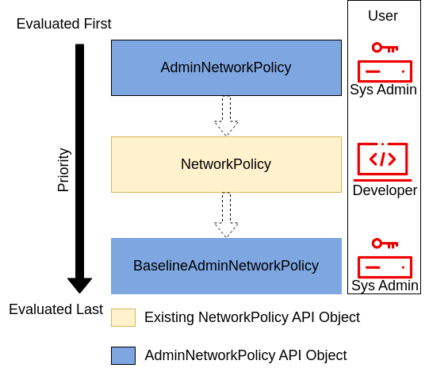

# NPEP-285: NPEP template

* Issue: [#285](https://github.com/kubernetes-sigs/network-policy-api/issues/285)
* Status: Provisional

## TLDR

Combine ANP and BANP into a single CRD.

## Goals

- Outline existing differences between ANP and BANP.
- Merge ANP and BANP into a single CRD.

## Non-Goals

(What is explicitly out of scope for this proposal.)

## Introduction

ANP and BANP are 2 layers of policies around NetworkPolicy, evaluated as shown in the diagram below.

  
Currently, ANP and BANP are 2 separate CRDs with the following differences:
- BANP is a singleton, which is also the reason why it doesn't have `spec.priority` field.
- ANP supports `Pass` action, while BANP doesn't. `Pass` action could be considered a delegation to the NetworkPolicy, 
or it could be seen as return from the current policy layer .
- ANP supports `domainNames` matching for egress rules, while BANP doesn't.

## User-Stories/Use-Cases

Story 1: Multiple BANPs

As a cluster admin, I want to apply different BANPs to different sets namespaces, so that I can have different default trust levels.
For example, "system" namespaces, like kube-system, could have a less strict BANP than "user" namespaces.

Story 2: Single CRD

As a cluster admin, I prefer to have 1 CRD for both ANP and BANP, so that it is easier to manage, understand, and monitor.
As an API implementation developer, I prefer to have 1 CRD for both ANP and BANP, so that I can reduce the complexity of the code.
As an API developer, I prefer to have 1 CRD for both ANP and BANP, so that I can reduce the complexity of the API and maintenance load.

## API

### Combining ANP and BANP

To combine ANP and BANP, we need to have a way to specify policy layer. Currently, we have the following options:
- Add a new field `spec.tier` to distinguish ANP vs BANP. The values could be `Overrride` and `Baseline`.
- Change `spec.priority` field to have a pre-defined value for NetworkPolicy, use numbers below for ANP, and numbers above for BANP.
For example, if we set NetworkPolicy priority to 0, then negative priorities would mean ANP, and positive priorities would mean BANP. 

#### Find a better name for `spec.priority`

While we are here, `priority` field name was brought to our attention multiple times as confusing. It should be mostly related to the fact
that "higher priority" means "lower number", which is counter-intuitive. Suggested alternatives are "order", "precedence", "sequence".

### Resolving differences between ANP and BANP

1. BANP is a singleton, which is also the reason why it doesn't have `spec.priority` field.  
Make BANP non-singleton and apply `spec.priority` field to it.

2. ANP supports `Pass` action, while BANP doesn't. `Pass` action could be considered a delegation to the NetworkPolicy,
  or it could be seen as return from the current policy layer.   
We have 2 options: allow using `Pass` for BANP, meaning that the rest od BANPs will be skipped or forbid this action for BANP.  
Unless we find strong reasons to forbid `Pass` for BANP, it makes sense to allow it to make the API more uniform.

3. ANP supports `domainNames` matching for egress rules, while BANP doesn't.  
The original reasoning from the 
[FQDN NPEP](https://github.com/kubernetes-sigs/network-policy-api/blob/feae59d056cf87131338a8449d31b85dc1d9790f/npeps/npep-133-fqdn-egress-selector.md?plain=1#L33-L38)
is
> Since Kubernetes NetworkPolicy does not have a FQDN selector, adding this
capability to BaselineAdminNetworkPolicy could result in writing baseline
rules that can't be replicated by an overriding NetworkPolicy. For example,
if BANP allows traffic to `example.io`, but the namespace admin installs a
Kubernetes Network Policy, the namespace admin has no way to replicate the
`example.io` selector using just Kubernetes Network Policies.

DNS Name selector is only [supported](https://github.com/kubernetes-sigs/network-policy-api/blob/feae59d056cf87131338a8449d31b85dc1d9790f/apis/v1alpha1/adminnetworkpolicy_types.go#L282)
with the `Allow` rule, which means the desired override by the NetworkPolicy could only be `Deny`. 
Due to the default-deny nature of NetworkPolicy, all required traffic in a namespace should be explicitly allowed, which means
the override of the BANP `Allow` DNS Name selector will happen automatically.

## Conformance Details

(This section describes the names to be used for the feature or
features in conformance tests and profiles.

These should be `CamelCase` names that specify the feature as
precisely as possible, and are particularly important for
Extended features, since they may be surfaced to users.)

## Alternatives

The only alternative is to leave ANP and BANP as 2 CRDs, the main advantage on this approach is that implementations that already support
an alpha version of the API don't need to introduce major changes. (But we have alpha to allow big changes like this, right?)

## References

Was discussed in the [Network Policy API meeting](https://docs.google.com/document/d/1AtWQy2fNa4qXRag9cCp5_HsefD7bxKe3ea2RPn8jnSs) on 11th and 25th February 2025.

