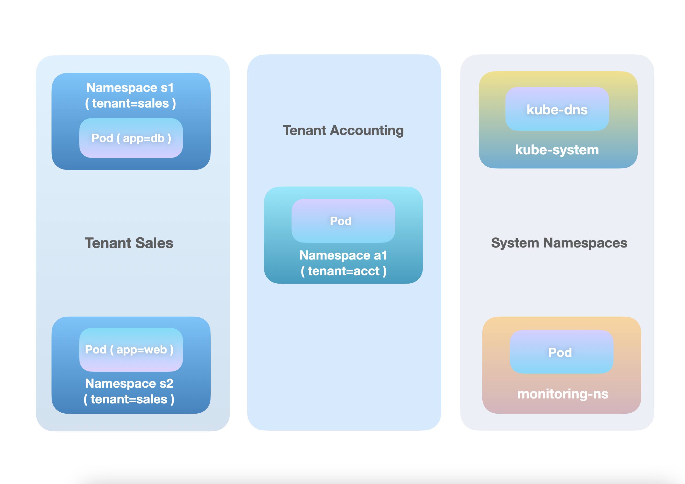
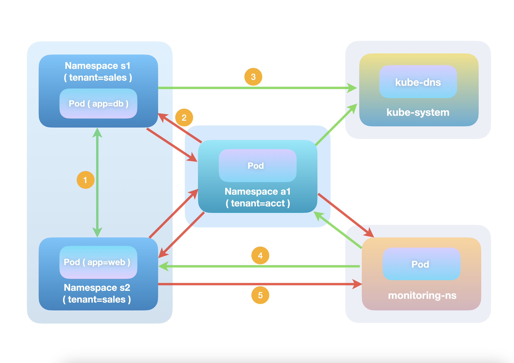
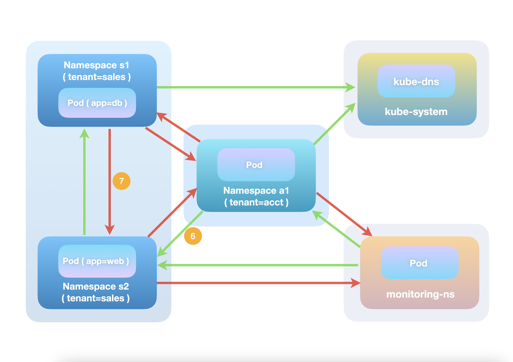

# Getting started with the AdminNetworkPolicy API

AdminNetworkPolicy API has been an exciting new addition towards the Kubernetes networking
space and is currently on its way towards beta. If you want to learn how to use the API and
how it interoperates with the existing NetworkPolicy API, you've landed at the right place :)
This blog post will take you through the ins-and-outs of the AdminNetworkPolicy objects, as
well as providing some basic sample specs for typical use-cases that the API solves.

<!-- more -->

### Problem Statement

Let's first consider a couple of very typical networking requirements for cluster admins:

1. There are certain traffic patterns in the cluster that, as a cluster admin, I want to
   always allow. For example, all namespaces should allow ingress traffic from a monitoring
   application in the cluster for compliance reasons, and all namespaces should allow egress
   toward kube-dns running in the kube-system namespace.

2. As a cluster admin I want to change the default security model for my cluster, so that
   all inter-tenant traffic (traffic between namespaces with different tenant labels) is
   blocked by default, unless it is known traffic explicitly allowed by namespace owners.

Both of the intents above however, are extremely difficult, if not impossible, to be
implemented with NetworkPolicies. For example, often developers accidentally block required
traffic (most commonly dns) when they apply NetworkPolicies. This is due to the implicit
deny nature of the NetworkPolicy semantics: pods selected by NetworkPolicies are automatically
isolated except for any ingress/egress traffic that is explicitly allowed.
So, without any admin-facing policy APIs, to "ensure" that dns always works and monitoring
probes are always permitted, cluster admins would have to apply the following specs in every
namespace of the cluster:

``` yaml
apiVersion: networking.k8s.io/v1
kind: NetworkPolicy
metadata:
  name: namespace-basic-allow
  namespace: apply-individually-in-every-namespace-of-the-cluster 
spec:
  podSelector: {}
  ingress:
    - from:
      - namespaceSelector:
          matchlabels:
            kubernetes.io/metadata.name: monitoring-ns
  egress:
    - to:
      - namespaceSelector:
          matchlabels:
            kubernetes.io/metadata.name: kube-system
        podSelector:
          matchlabels:
            app: kube-dns
```

Problems with the above approach:

1. Namespace owners can easily override the NetworkPolicy rules by modifying them directly
   or simply deleting the policy, since the objects are namespace-scoped and modifiable by
   any user or service account with the correct RBAC permissions;
2. Namespaces can be dynamically created and terminated and there is no easy way to apply
   a NetworkPolicy(s) to a namespace before it exists. To work around this limitation,
   cluster admins often utilize an external operator/controller to ensure that each namespace
   has a required set of NetworkPolicies at the time of creation;
3. There's no way for cluster admins to express intents like, I want to take a default
   security stance on certain types of traffic, but I want to also delegate the ultimate
   decision to each namespace owner.

So why does the NetworkPolicy API fail to serve these admin use cases? Short answer: it was
not designed for them to begin with.

NetworkPolicy was designed around the idea of allowing the user deploying an application to
control who can and cannot reach that application. It was not intended to be used for any
other use cases, and its design reflects this:

- It has no concept of explicit "deny" rules, because the application deployer can simply
  refrain from allowing the things they want to deny.
- It doesn't include priorities, or any concept of one user "outranking" another and being
  able to override their policies, because a given application is expected to only have
  policies created by a single user (the one deploying the application).

---

### Securing cluster with the AdminNetworkPolicy API

Enter AdminNetworkPolicy API to the rescue. Designed specifically for cluster administrators,
the AdminNetworkPolicy API provides two cluster-level resources that can not only enforce
inviolable policy rules (for traffic that should always be allowed or denied), but also
provide cluster default guardrails that can be overridden by namespace users if needed.

Follow along with the example below, as we showcase how the AdminNetworkPolicy API achieves
this, and how it interoperates with NetworkPolicy objects to provide a complete,
priority-based policy enforcing solution in a K8s cluster.

Imagine we have a bare-bones cluster set up by a company's IT team, which only has a
handful of namespaces. The sales team owns two namespaces `s1` and `s2` (both labeled
tenant=sales), which runs web and db applications respectively. On the other hand,
the accounting team owns a single namespace `a1`, which, for demonstration purposes,
only has a single pod deployed. In addition, there is a `monitoring-ns` running an
application that needs to probe into namespaces required by compliance team. Of course
there is also `kube-system` who provides DNS services for the cluster via its `kube-dns`
pods.


<p style="text-align: center"><b>Tenants and System Namespaces</b></p>

With the help of the new API, admins can easily implement the networking requirements
mentioned above, namely isolating pods in different tenants by default and ensuring all
pods are able to make DNS requests and accepting monitoring probes.

The syntax for the AdminNetworkPolicy API is very similar to that of the current network
policy API. However, there are some traits of the AdminNetworkPolicy API that are very
different and worth highlighting:

- `AdminNetworkPolicy` and `BaselineAdminNetworkPolicy` are cluster-scoped resources.
  The subject of the policy can be the entire cluster namespaces, a select set of namespaces,
  or even select set of pods in a select set of namespaces, depending on the actual use of
  the policy.

- AdminNetworkPolicy rules support explicit actions, including `Allow`, `Deny` and `Pass`.

- AdminNetworkPolicy rules should be interpreted as-is: pod-to-pod traffic only matches the
  rule if all criteria listed in the rule are matched. That means src and dst of the packet
  matches subject and ingress/egress peer selection, and in addition port/protocol also
  matches, if those are specified in the rule. If so, `action` of the rule makes final verdict
  on whether the packet is allowed, dropped, or selected to skip any further policy rule
  evaluations. Otherwise, traffic will continue to be matched against lower-precedence
  `AdminNetworkPolicy` rules, K8s NetworkPolicies and finally, `BaselineAdminNetworkPolicy`
  rules, until all policy rules are exhausted and no rule matches. At that time, Kubernetes'
  default networking requirement will apply, which states that all pods can communicate with
  each other without NAT.

- AdminNetworkPolicy rules are enforced in a hierarchical order based on priority.
  `AdminNetworkPolicy` objects with a smaller numerical `priority` in its spec have higher
  precedence over those with a larger numerical `priority`. Furthermore, rules inside a
  policy are enforced in the order they are written (ingress and egress rules does not have
  relevant order among each other though). To avoid potential conflict in rules, we generally
  advise against creating multiple `AdminNetworkPolicy` objects at the same `priority`.

- The AdminNetworkPolicy API does not change K8s NetworkPolicy's [implicit isolation effect](
  https://kubernetes.io/docs/concepts/services-networking/network-policies/#the-two-sorts-of-pod-isolation).
  If a pod is selected by a NetworkPolicy with egress rules, any egress traffic from the pod,
  if not explicitly allowed by an `AdminNetworkPolicy` rule or a NetworkPolicy rule, will be
  dropped due to this isolation effect and thus will not be evaluated further against
  `BaselineAdminNetworkPolicy` rules. The same applies for ingress direction traffic.

```yaml
apiVersion: policy.networking.k8s.io/v1alpha1
kind: AdminNetworkPolicy
metadata:
  name: cluster-basic-allow
spec:
  priority: 5
  subject:
    namespaces: {}
  ingress:
  - action: Allow   # Allows connection #4 labeled in the diagram below
    from:
    - namespaces:
        namespaceSelector:
          matchLabels:
            kubernetes.io/metadata.name: monitoring-ns
  egress:
  - action: Allow   # Allows connection #3 labeled in the diagram below
    to:
    - namespaces:
        namespaceSelector:
          matchlabels:
            kubernetes.io/metadata.name: kube-system
      pods:
        podSelector:
          matchlabels:
            app: kube-dns
```

```yaml
apiVersion: policy.networking.k8s.io/v1alpha1
kind: BaselineAdminNetworkPolicy
metadata:
  name: default
spec:
  subject:
    namespaces:
      namespaceSelector:  # Selects all non-kube-system Namespaces in the cluster
        matchExpressions:
          - {key:  kubernetes.io/metadata.name, operator: NotIn, values: [kube-system]}
  egress:
  - action: Allow         # Allows connection #1 labeled in the diagram below
    to:
    - namespaces:
        sameLabels: tenant
  - action: Deny          # Drops connection #2 and #5 labeled in the diagram below
    to:
    - namespaces:
        namespaceSelector: {}
```

With these characteristics of the AdminNetworkPolicy API in mind, let's take a look at how the
two example policies secure cluster traffic with the help of a connection flow diagram. We
have labeled a number of specific connections, which will be described in further detail below.
Note that currently there are no NetworkPolicy instances created in any namespace.


<p style="text-align: center"><b>After AdminNetworkPolicy Applied</b></p>

1. **Traffic between the sales tenant pods is allowed.** Firstly, no `AdminNetworkPolicy`
   rule matches this type of traffic. Both tenant=sales namespaces are indeed selected by the
   "cluster-basic-allow" `AdminNetworkPolicy`, but the connection in question is neither going
   to dns components nor from the monitoring namespace. Moving further down the hierarchy, no
   `NetworkPolicy` can possibly be matched as well since there are none of them in the cluster
   currently. Finally, the "default" `BaselineAdminNetworkPolicy` is evaluated, and this
   traffic flow matches the first rule of the `BaselineAdminNetworkPolicy` egress section: for
   packets sent by the `app=db` pod towards the `app=web` pod, the first egress rule is matched
   from the perspective of namespace `s1`, since the rule dictates that for all namespaces any
   egress traffic going to namespaces with the same `tenant` label should be given the green
   light. The same logic applies for the reverse traffic.

2. **Traffic across tenant boundaries is _not_ allowed.** For the same reason as above, no rule
   matches at the `AdminNetworkPolicy` and `NetworkPolicy` level. Looking at the "default"
   `BaselineAdminNetworkPolicy` again, it also fails to match the first egress rule, since
   from either the sales or accounting team's perspective, this type of traffic is not steered
   towards namespaces with the same `tenant` label. Moving further down to the rules below, it
   hits the "catch all" egress rule, which essentially states that by default, no pod in any
   namespace can send any traffic to another pod in any namespace (except for the explicitly
   allowed traffic listed at a higher priority obviously).

3. **Traffic towards `kube-dns` pods in `kube-system` from any namespace is always allowed.**
   This is due to the fact that it matches the first egress rule defined in the "cluster-basic-allow"
   `AdminNetworkPolicy`. Because of that, no further rule evaluation will happen for lower
   precedence AdminNetworkPolicy rules, K8s NetworkPolicies or BaselineAdminNetworkPolicies.

4. **Traffic from the `monitoring-ns` towards any namespace is always allowed,** for similar
   reasons as 3.

6. **Traffic from the sales tenant namespaces (or the accounting tenant namespace) towards the
   `monitoring-ns` is _not_ allowed,** for the same reasons as 2.

---

### NetworkPolicy Interoperation

This looks great from the admin's perspective, but what about namespace owners/developers? What
if the sales team decides that they are okay with sharing data to the accounting team, but
only through the web application packaged with pre-defined queries instead of the db instances?
The `BaselineAdminNetworkPolicy` makes this task a breeze.
Without having to raise tickets to cluster admins for allow rule creation, in the current
framework the sales team can actually define their own NetworkPolicies to maintain full control
over the application they want to expose to other namespaces, without having to raise tickets
to cluster admins for allow rule creation:

```yaml
apiVersion: networking.k8s.io/v1
kind: NetworkPolicy
metadata:
  name: allow-access-to-web
  namespace: s2
spec:
  podSelector: {}
  ingress:
    - from:
        - namespaceSelector:
            matchLabels:
              kubernetes.io/metadata.name: a1
```

If the `allow-access-to-web` NetworkPolicy is created in `s2` (the AdminNetworkPolicy and
BaselineAdminNetworkPolicy from the previous section still exist at the cluster level), the
security posture of that namespace will change fundamentally compared to the diagram above.
In particular, ingress traffic from namespace `a1` (labeled 6 in the figure below) will be
able to connect to `s2` pods since it is explicitly allowed in the NetworkPolicy, which is
evaluated before any `BaselineAdminNetworkPolicy` rules.


<p style="text-align: center"><b>AdminNetworkPolicy and NetworkPolicy Interoperation</b></p>

On the other hand, there's a caveat that many will find surprising: traffic from `s1`, the
other sales tenant namespace, will be blocked(7) when it reaches the pod in `s2`. Did we not
create a baseline allow rule for each namespace in the same tenant to connect to each other?
Yes we did. But as mentioned before, the AdminNetworkPolicy API does not change the behavior
of NetworkPolicy objects. The `allow-access-to-web` NetworkPolicy, in this case, can be read
as "all pods in s2 are isolated in the ingress direction, except for traffic from a1 which is
allowed". So connections initiated from `s1` to `s2` will be dropped due to this implicit
isolation effect before the `BaselineAdminNetworkPolicy` rules are even evaluated.

The remedy is simple enough though: the `s2` namespace owner (presumably also owns `s1`) can
simply add an additional ingress rule to the `allow-access-to-web` NetworkPolicy to allow
traffic from `s1`. The important aspect here though, is that once a NetworkPolicy is applied
to a pod, it will control it security posture at entirety, unless a `AdminNetworkPolicy` rule
overrides it from a priority above. `BaselineAdminNetworkPolicy` rules are only effective in
the absence of those policies

### Takeaways and Next Steps

The new AdminNetworkPolicy API, together with NetworkPolicy, provides a holistic in-cluster
policy enforcement framework for both the admin and namespace owners/developers. The API itself,
however, is still evolving, and the network-policy-api working group is proposing an array of
exciting features, including egress, tenancy and FQDN support for the AdminNetworkPolicy API
before it goes beta. Those features are tracked as NPEPs (Network Policy Enhancement Proposal)
under the [npeps directory](https://github.com/kubernetes-sigs/network-policy-api/tree/main/npeps).
Feedbacks are much appreciated! If you are looking to get involved, check out our
[website](https://network-policy-api.sigs.k8s.io/) and
[slack channel](https://kubernetes.slack.com/messages/sig-network-policy-api) for additional
details on how you can help shape the future of network policy in Kubernetes.
